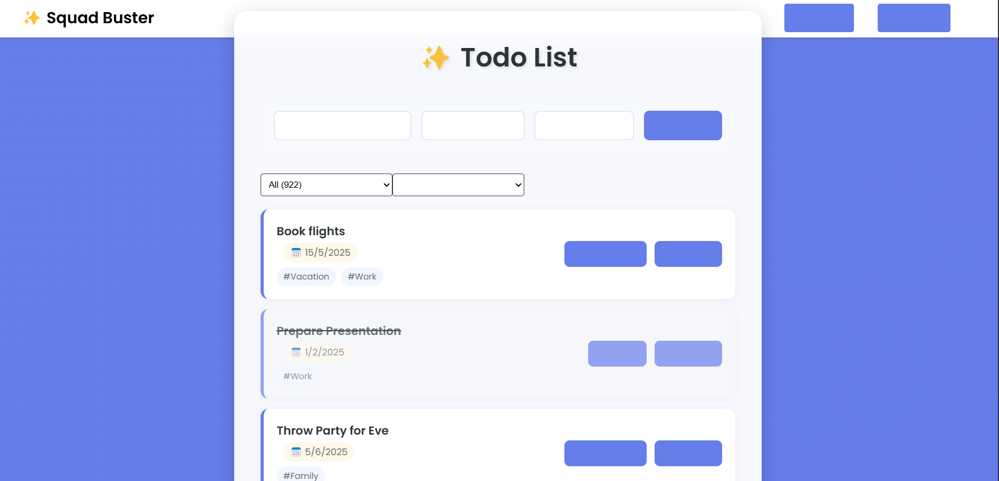
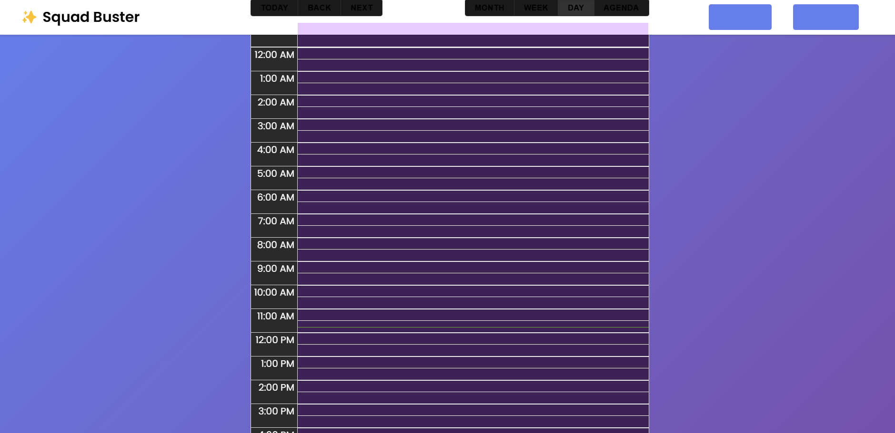

# Dumbathon - The "Invisible" Todo App

A hackathon submission for the "Dumbathon" - where the challenge was to create a functional application with deliberately frustrating UX decisions.

## The Challenge

This todo application was created with two major restrictions:
1. All button texts must be invisible (transparent)
2. No alerts, dialogues, or popups allowed for user feedback

These restrictions force users to discover functionality through trial and error, making it deliberately challenging but still fully functional.

## How to Use (if you dare)

- Invisible buttons are still clickable - hover and click to discover their functions!
- No error messages will guide you - figure out the required fields through experimentation
- The app is fully functional, just... deliberately obtuse

## Project Structure

```
/Dumbathon/
├── frontend/
│   └── src/
│       ├── App.js           # Main React application
│       ├── components/
│       │   ├── Navbar/      # Navigation component
│       │   └── Calendar/    # Calendar view component
│       └── App.css
├── backend/
│   ├── server.js           # Express server setup
│   ├── config/
│   │   ├── db.js          # MongoDB connection
│   │   └── mock.js        # Mock data setup
│   └── routes/
│       └── todoRoutes.js   # API routes
```

## Tech Stack

- Frontend:
  - React
  - React Router DOM
  - Axios
  - CSS for styling
- Backend:
  - Node.js
  - Express
  - MongoDB
  - Cors
  - Dotenv

## Features

- Create, Read, Update, and Delete todos (with invisible button labels!)
- Category-based filtering
- Due date assignment
- Calendar view
- Task completion toggling
- Category counts
- Responsive design
- Zero helpful error messages
- Maximum user confusion (by design)

## Screenshots


*Main view with invisible buttons - hover over the transparent areas to find them!*


*Calendar view showing scheduled tasks*

## Video Demo

Check out how the "invisible" todo app works in practice:

[Watch Demo Video](https://youtu.be/dBWpHmzbc4Q)

Quick demonstration of:
- Creating a new todo (finding the invisible submit button)
- Completing tasks (discovering interactive elements)
- Deleting todos
- Filtering by categories
- Calendar navigation


## Setup Instructions

1. Clone this repository
```bash
git clone [repository-url]
cd Dumbathon
```

2. Backend Setup
```bash
cd backend
npm install
# Create .env file with:
# PORT=5000
# MONGODB_URI=your_mongodb_connection_string
npm start
```

3. Frontend Setup
```bash
cd frontend
npm install
npm start
```

The application will be available at:
- Frontend: http://localhost:3000
- Backend API: http://localhost:5000

## API Endpoints

- GET `/api/todos` - Fetch all todos
- POST `/api/todos` - Create new todo
- PUT `/api/todos/:id` - Update todo
- DELETE `/api/todos/:id` - Delete todo

## Todo Object Structure

```javascript
{
  title: String,
  categories: Array[String],
  dueDate: Date,
  completed: Boolean
}
```

## Environment Variables

Backend `.env` configuration:
```
PORT=5000
MONGODB_URI=your_mongodb_connection_string
```

## Development

To run in development mode:

1. Start backend server:
```bash
cd backend
npm run dev
```

2. Start frontend development server:
```bash
cd frontend
npm start
```

## Design Philosophy

This project was created for a hackathon that challenged developers to create "deliberately frustrating" user experiences while maintaining full functionality. Key aspects include:

1. **Invisible Interaction**: All button texts are transparent, forcing users to discover functionality through exploration
2. **No Error Feedback**: Due to restrictions on alerts/dialogues, users must figure out required fields through trial and error
3. **Full Functionality**: Despite the UX challenges, the application maintains complete CRUD capabilities

## Hackathon Restrictions

1. **Button Text Visibility**: All action buttons must have transparent text
2. **No Alert/Dialogue Boxes**: No popup messages or alerts allowed for user feedback
3. **Maintain Functionality**: App must remain fully functional despite UX restrictions

## Contributing

1. Fork the repository
2. Create your feature branch (`git checkout -b feature/AmazingFeature`)
3. Commit your changes (`git commit -m 'Add some AmazingFeature'`)
4. Push to the branch (`git push origin feature/AmazingFeature`)
5. Open a Pull Request

## License

[MIT License](LICENSE)